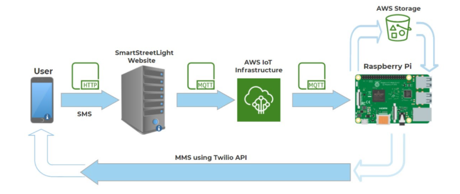

# Smart Streetlight
Senior Capstone Project

<h1>Design Specification</h1>
Project design focuses on improving on the power management system of the  streetlights and reducing the carbon emission created by street parking. By integrating dimmable  light-emitting diodes (LEDs) and cellular technology we can control the intensity of the streetlights  depending on the needs of the street users. By integrating the smart parking feature, we can find parking spots more efficiently, consuming less carbon and time. The following is a list of  requirements the system aims to fulfill:   
1. Motion Detection: This will ensure that the lights change intensities only when motion is  detected.  
2. Microcontroller: This will help in data processing based on motion detection, provide  cellular interface via cellular modem and control LED brightness via LED driver circuit.  
3. Cellular Communication: This allows one streetlight to communicate between the server  which then communicates with other streetlights. This allows the motion detected by one  streetlight to impact the adjacent streetlights, allows enough light for cars or pedestrians.  
4. LED Brightness control: This will ensure that in the absence of people or vehicles on the  street, the LEDs brightness will be dimmed.  
5. Energy efficient: By having the feature to brighten and dim the streetlights when needed, the amount of energy needed to power the streetlights will decrease. In addition, with the  help of our smart parking feature, it will take a significantly less amount of time to find  parking, resulting in less pollution created by cars.  

<h2>Block Diagram of Design</h2>

 
<h2>Block Diagram of Parking Application</h2>

 
<h2>Wiring</h2>

 
<h2>Final Build</h2>

 
<h2>Example MMS Message</h2>

